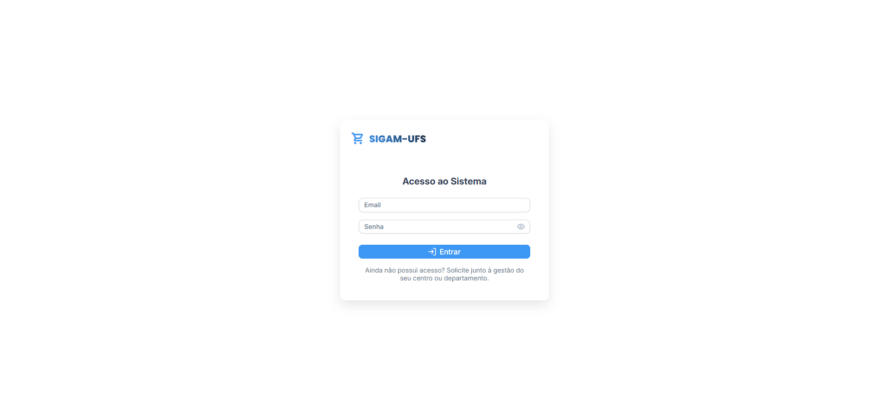
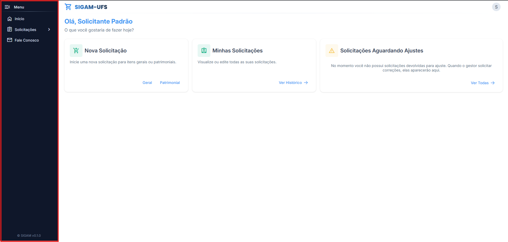
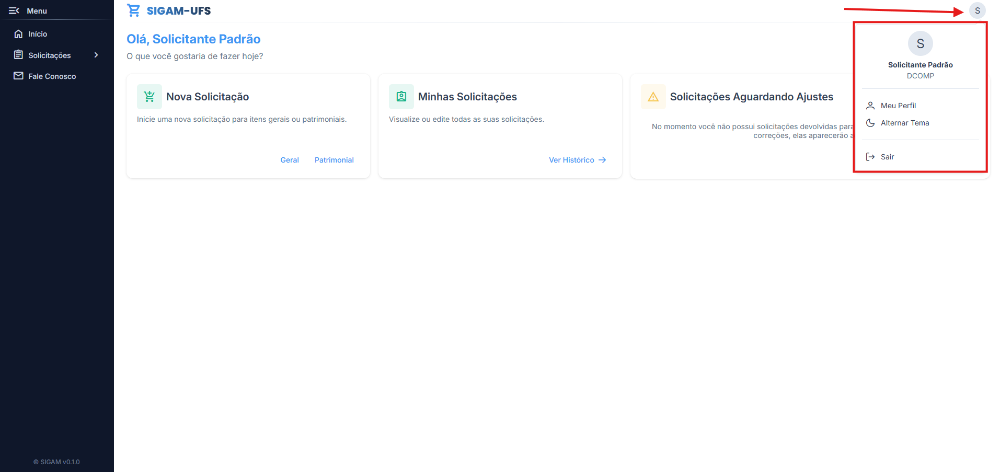
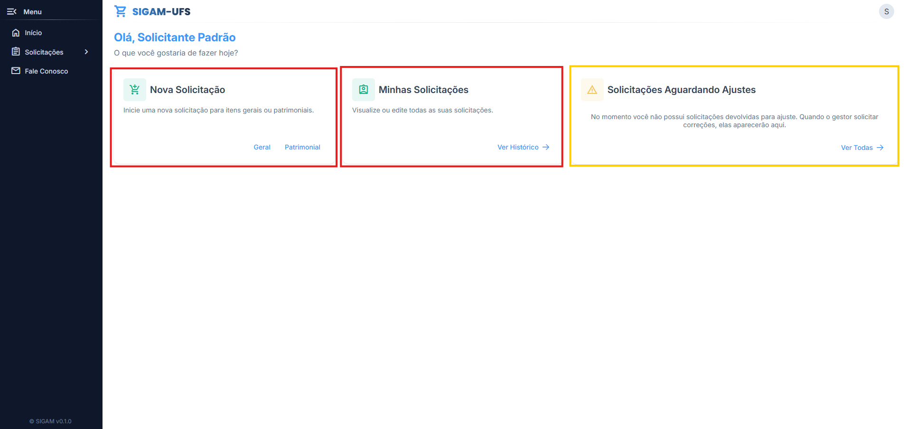

# 06 - Manual do Solicitante

Este manual apresenta apenas as funcionalidades do perfil `Solicitante`.

## 1. Acesso ao sistema

### 1.1 Login

1. Acesse a tela `Acesso ao Sistema`.
2. Preencha os campos `Email` e `Senha`.
3. Clique em `Entrar`.

Mensagens de validação mais comuns:
- `O email é obrigatório.`
- `A senha é obrigatória.`

### 1.2 Navegação do solicitante

Menu disponível para solicitante:
- `Início`
- `Solicitações`
- `Fale Conosco`

Menu do avatar:

- `Meu Perfil`
- `Alternar Tema`
- `Sair`

## 2. Página inicial

Na home, o solicitante tem acesso aos atalhos:
- `Nova Solicitação` (botões `Geral` e `Patrimonial`)
- `Minhas Solicitações` (botão `Ver Histórico`)

Também possui o card:
- `Solicitações Aguardando Ajustes` com botão `Ver Todas`.

## 3. Criar solicitação

Tipos de solicitação:
- `Patrimonial` (`/solicitacoes/criar/patrimonial`)
  - Solicitações para itens pertencentes a categoria `Eletrodomésticos` e `Mobiliário`, que representam itens permanentes, que precisam de justificativa individual por item.
- `Geral` (`/solicitacoes/criar/geral`)
  - Solicitações para itens das demais categorias existentes: `Componentes Eletrônicos`, `Ferramentas`, `Reagentes Químicos`, `Materiais de Laboratório` e `Diversos`.

### 3.1 Passo a passo
1. Na tela inicial, no card `Nova Solicitação`, escolha `Geral` ou `Patrimonial`.

2. Na área `Buscar Itens`, localize os materiais desejados.

3. Use os filtros quando necessário:
  - `Pesquisar item`
  - `Categoria`
  - `Ordem`
  - `Filtros Avançados`
  - `Buscar`
  - `Limpar`
4. É possível clicar na imagem de um item para ver mais detalhes sobre ele.
  

5. Clique em `Adicionar à Solicitação` (ou no ícone `+` do item).
6. Na área `Sua Solicitação`, preencha os campos dos itens:
  - `Qtde.`
  - `Preço Unitário`
  - `Justificativa` (se patrimonial)
7. Se a solicitação for `Geral`, preencha `Justificativa Geral`.
8. Clique em `Solicitar`.

### 3.2 Ações importantes durante a criação

  - `Limpar Solicitação`: remove todo o conteúdo da solicitação em andamento.
  - Ícone de lixeira no item: remove item individual.
  - Ao clicar no item, você pode abrir o diálogo de detalhes e também adicionar por lá.

### 3.3 Regras de negócio da criação
  - A solicitação deve ter pelo menos 1 item.
  - Quantidade e preço unitário precisam ser maiores que zero.
  - Em solicitação `Geral`, `Justificativa Geral` é obrigatória.
  - Em solicitação `Patrimonial`, a justificativa é obrigatória item por item.
  - Existe limite de `Quantidade máxima por item` (Configurável pelo Gestor do Sistema).
  - Existe limite de `Itens diferentes por solicitação` (Configurável pelo Gestor do Sistema).
  - Após o prazo final, envio e edição ficam bloqueados.

### 3.4 Regras de rascunho e descarte

- O sistema mantém apenas 1 solicitação em andamento no carrinho.
- Se você iniciar um tipo (`Geral`) e abrir o outro (`Patrimonial`), o sistema pede confirmação para descartar a solicitação atual.
- Ao tentar sair com alterações não salvas, o sistema alerta para evitar perda de dados.

## 4. Minhas Solicitações

Rota: `/solicitacoes`

### 4.1 Filtros da listagem
- `Código`
- `Data de Criação` (intervalo)
- `Tipo`
- `Status`
- Ordenação por data (`Ordenar por Data`, `Mais Recentes`, `Mais Antigos`)
- Botões `Buscar` e `Limpar`

### 4.2 Ações da listagem
- Na coluna `Ações`, clique em `Ver Detalhes` (Ícone de um olho).
- Quando não houver resultados, os botões `Geral` e `Patrimonial` permitem iniciar nova solicitação.
- A paginação permite navegar entre páginas da listagem.

## 5. Detalhes da solicitação

Rota: `/solicitacoes/:id`

### 5.1 Informações exibidas
- Requisitante e sua unidade (departamento).
- Data e hora de criação.
- Tipo da solicitação (`Geral` ou `Patrimonial`).
- Status atual.
- `Motivo informado` quando houver observações de status.
- Justificativa Geral (se solicitação geral)

### 5.2 Abas disponíveis
- `Itens Solicitados`
- `Insights`
- `Histórico`

Na aba `Insights`, o sistema mostra indicadores e gráficos da solicitação atual.
Na aba `Histórico`, o sistema mostra as alterações com data, usuário e observações.

### 5.3 Edição pelo solicitante
O botão `Editar` aparece somente quando:
- a solicitação pertence à mesma unidade/departamento do solicitante logado;
- o status está em `Pendente` ou `Aguardando Ajustes`;
- o prazo para ajustes não expirou.

Passos:
1. Clique em `Editar`.
2. Atualize itens, quantidades, preços e justificativas.
3. Clique em `Salvar` para confirmar.
4. Use `Cancelar` para descartar.

## 6. Status da solicitação (referência)

- `Pendente`: aguardando análise do gestor.
- `Aguardando Ajustes`: devolvida pelo gestor para correção.
- `Aprovada`: aceita pelo gestor.
- `Rejeitada`: negada pelo gestor.
- `Cancelada`: cancelada pelo gestor (irreversível).
- `Encerrada`: arquivada automaticamente pelo sistema por ser de anos anteriores (irreversível).

## 7. Meu Perfil

Rota: `/perfil`

Funcionalidades:
- `Editar Perfil` para atualizar `Telefone` e `CPF`.
- `Salvar Alterações` e `Cancelar`.

Observações:
- `Nome` e `E-mail` não podem ser alterados por esta tela.

## 8. Fale Conosco

Rota: `/fale-conosco`

Status atual:
- Funcionalidade ainda não está integrada ao backend.
- Não existe protocolo/chamado registrado no sistema neste momento.
- Implementação completa de atendimento é prevista para evolução futura.

Comportamento atual da tela:
1. Preencha `Nome`, `E-mail`, `Assunto` e `Mensagem`.
2. (Opcional) preencha `Telefone`.
3. Clique em `Enviar Mensagem`.
4. Use `Limpar` para reiniciar o formulário.

Validações:
- Nome obrigatório.
- E-mail obrigatório e válido.
- Assunto obrigatório.
- Mensagem obrigatória com mínimo de 10 caracteres.

Observação:
- O canal ainda não possui fluxo oficial de atendimento com backend.

## 9. Boas práticas

- Revise quantidade, preço e justificativas antes de enviar.
- Use filtros para localizar solicitações antigas mais rápido.
- Ao receber `Aguardando Ajustes`, priorize corrigir e reenviar antes do prazo.
- Consulte a aba `Histórico` para entender mudanças e observações.
